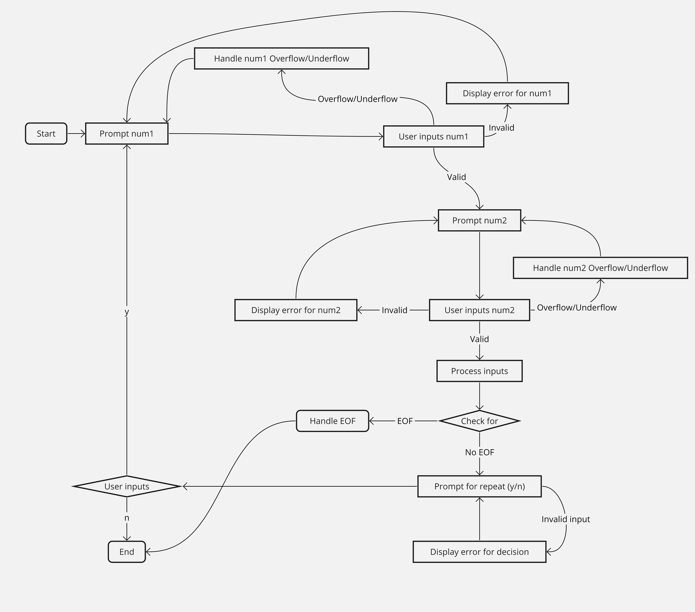

### README for `getInput` Function

#### Description

The `getInput` function is a template utility designed to facilitate robust and error-resistant user input in C++ applications. It streamlines acquiring valid data from the user, handling errors gracefully, and ensuring that the input conforms to the expected data type.

#### Features

- **Type Agnostic**: Works with any data type that supports stream extraction via `cin`.
- **Error Handling**: Provides immediate feedback on invalid inputs and prompts the user to retry until a valid input is received.
- **Character-Specific Validation**: Includes special handling for character inputs, ensuring they match expected responses ('y' or 'n').
- **Macro Usage**: Utilizes macros to encapsulate common strings and conditions, simplifying modifications and enhancing readability.

#### Usage

To use the `getInput` function in your program, include its definition at the top of your source file. You can then call it whenever you need to obtain input from the user, specifying the prompt message and the variable to store the input.

Example usage for an integer and a character:

```
int number;
char decision;

getInput("Please enter a number: ", number);
getInput("Continue? (y/n): ", decision);
```

#### Scenario

Imagine a scenario where you need to collect a series of numbers and decisions from a user within a loop. Using `getInput`, you can ensure that the loop continues seamlessly, handling any incorrect inputs gracefully and keeping the user informed. It's particularly useful in applications requiring robust user interaction, like CLI tools, data entry applications, or interactive simulations.

#### Scenario: Inputting Two Numbers

This scenario illustrates various user interactions while inputting two numbers (num1 and num2) and shows how the program responds to each.

1. **Both Inputs Are Valid:**

   - System prompts for num1 and num2 sequentially.
   - User enters `5` for num1 and `10` for num2.
   - System successfully accepts the inputs and proceeds.

2. **First Input Is Invalid:**

   - System prompts for num1.
   - User enters a non-integer, e.g., `abc`.
   - System displays an error and reprompts for num1.
   - User then enters a valid integer, e.g., `7`.
   - System prompts for num2 and user enters a valid integer.

3. **Second Input Is Invalid:**

   - System prompts for num1 and user enters a valid integer.
   - System prompts for num2.
   - User enters a non-integer, e.g., `xyz`.
   - System displays an error and reprompts for num2.
   - User then enters a valid integer.

4. **Both Inputs Are Invalid Initially:**

   - System prompts for num1.
   - User enters a non-integer, e.g., `hello`.
   - System displays an error and reprompts for num1 until a valid integer is entered.
   - System prompts for num2.
   - User enters a non-integer, e.g., `world`.
   - System displays an error and reprompts for num2 until a valid integer is entered.

5. **Valid Inputs with Leading and Trailing Spaces:**

   - System prompts for num1 and num2 sequentially.
   - User enters `  5` for num1 and `10  ` for num2 (inputs have leading and trailing spaces).
   - System trims the spaces (assuming standard stream extraction behavior) and successfully accepts the inputs.

6. **Input Interrupted by Early Termination (EOF or similar):**

   - System prompts for num1.
   - User sends an EOF signal (e.g., Ctrl+D on Linux/macOS or Ctrl+Z on Windows) instead of entering a number.
   - System needs to handle this case, potentially by terminating the input phase or the program gracefully.

7. **Input Causes Integer Overflow:**

   - System prompts for an integer.
   - User enters a value that exceeds the maximum limit for an integer.
   - System detects the overflow, displays an error, and reprompts for the input.

8. **Input Causes Integer Underflow:**
   - System prompts for an integer.
   - User enters a value that is below the minimum limit for an integer.
   - System detects the underflow, displays an error, and reprompts for the input

### Sample Numbers for Testing Scenarios

1. **Both Inputs Are Valid:**

   - num1: `5`
   - num2: `10`

2. **First Input Is Invalid (Non-integer):**

   - num1: `abc` (invalid, should prompt for re-entry)
   - num1 (retry): `7`

3. **Second Input Is Invalid (Non-integer):**

   - num2: `xyz` (invalid, should prompt for re-entry)
   - num2 (retry): `9`

4. **Both Inputs Are Invalid Initially (Non-integers):**

   - num1: `hello` (invalid, should prompt for re-entry)
   - num1 (retry): `3`
   - num2: `world` (invalid, should prompt for re-entry)
   - num2 (retry): `8`

5. **Valid Inputs with Leading and Trailing Spaces:**

   - num1: `"  5"` (interpreted as 5)
   - num2: `"10  "` (interpreted as 10)

6. **Input Interrupted by Early Termination (EOF):**

   - To simulate: Use the EOF character (Ctrl+D on Linux/macOS, Ctrl+Z in Windows command line) when prompted for num1 or num2.

7. **Input Causes Integer Overflow:**

   - For a 32-bit `int`, use: `2147483648` (just over \(2^{31} - 1\))
   - This input should cause an overflow error.

8. **Input Causes Integer Underflow:**
   - For a 32-bit `int`, use: `-2147483649` (just below \(-2^{31}\))
   - This input should cause an underflow error.

#### Scenario: Swapping Integers

The `getInput` function is demonstrated in a scenario where two integers are swapped. This process is outlined step by step below, showing potential user inputs and system responses.

1. **Initial Input Prompt:**

   - System: "Please enter a number for num1 (int): "
   - User: Enters `12`
   - System: "Please enter a number for num2 (int): "
   - User: Enters `34`

2. **Before Swap Output:**

   - System: "Before swap (integers):
     12
     34"

3. **After Swap Output:**

   - System: "After swap (integers):
     34
     12"

4. **Repeat Prompt:**
   - System: "Do you want to repeat the program? (y/n): "
   - User: Enters an invalid input `x`
   - System: "Invalid input. Please enter 'y' or 'n'."
   - System: "Do you want to repeat the program? (y/n): "
   - User: Enters `n`


